# 📱 Balance Sugar

**Balance Sugar** is a comprehensive diabetes management app built using Flutter and Django. It empowers diabetic, pre-diabetic, and at-risk users to monitor their glucose, manage medication, track meals, analyze foot ulcers, and interact with an AI assistant — all from a single mobile application.

---

## Key Features

- **Glucose Tracking**: Log and monitor blood glucose levels with context-aware analysis (e.g., pre- or post-meal) and AI-based trend predictions after 16 readings.
- **Meal Management**: Track daily food intake with nutritional breakdowns (calories, carbs, proteins, fats, sugars) and personalized calorie goals.
- **Medication Management**: Schedule medication reminders, track dosages, and receive AI-driven drug interaction warnings.
- **Foot Ulcer Monitoring**: Upload foot images for AI-powered ulcer detection and segmentation, with progress tracking over time.
- **AI Chatbot**: A multilingual (English/Arabic) chatbot powered by Google Generative AI, offering instant, empathetic diabetes-related guidance.
- **User-Friendly Interface**: Designed with Figma, featuring intuitive navigation, clean layouts, and accessible input/output mechanisms.
- **Secure Backend**: Built with Django and SQLite, ensuring robust authentication (JWT), data encryption, and scalable API integration.

## Screenshots and Demo

Below are snapshots of Balance Sugar’s key screens, showcasing its intuitive design and functionality, followed by a demo video.

| | | | |
|-|-|-|-|
|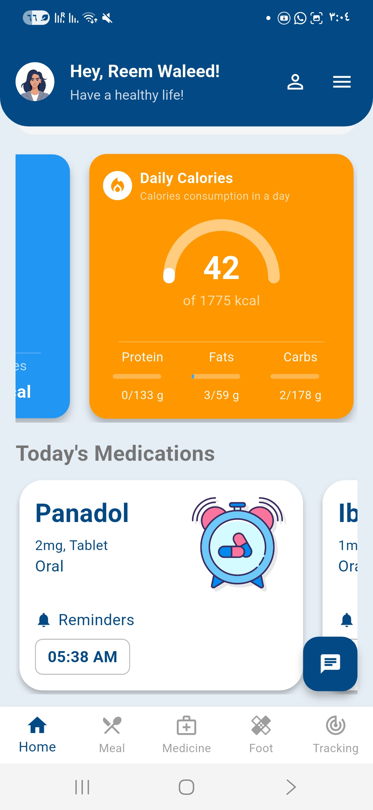|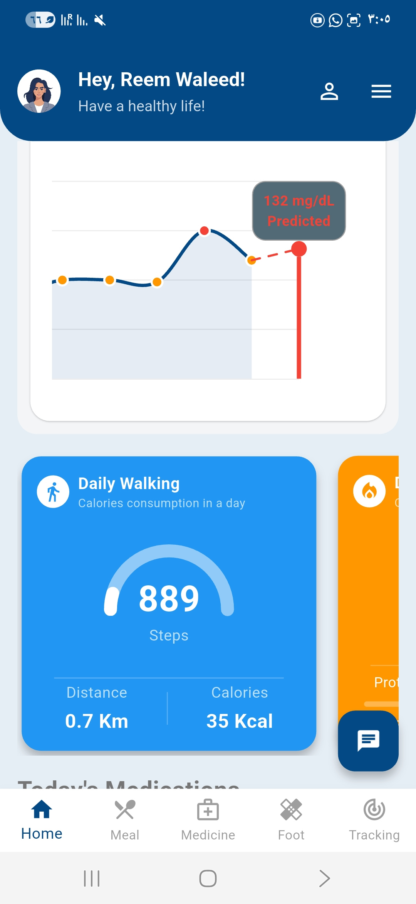|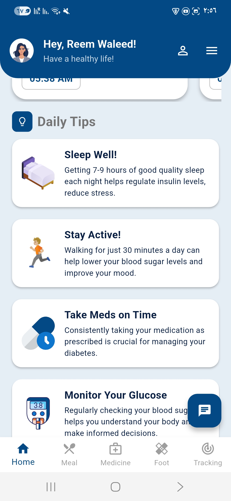|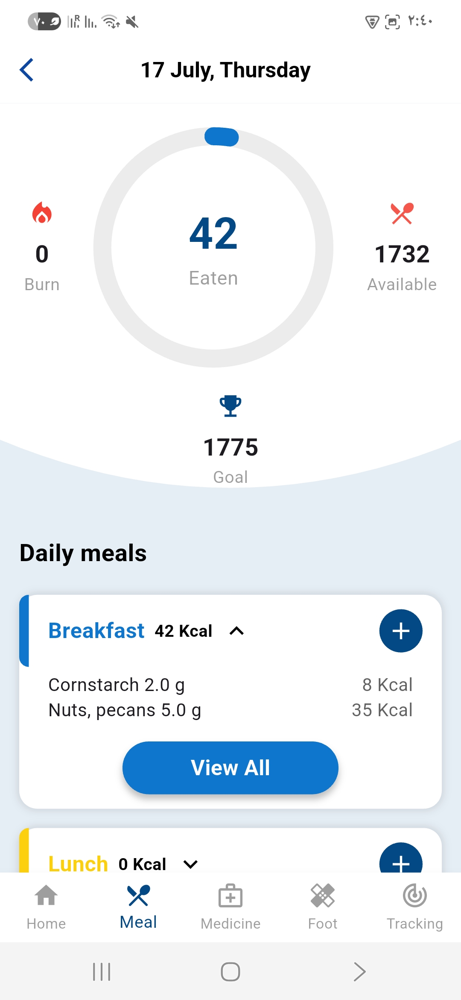|
|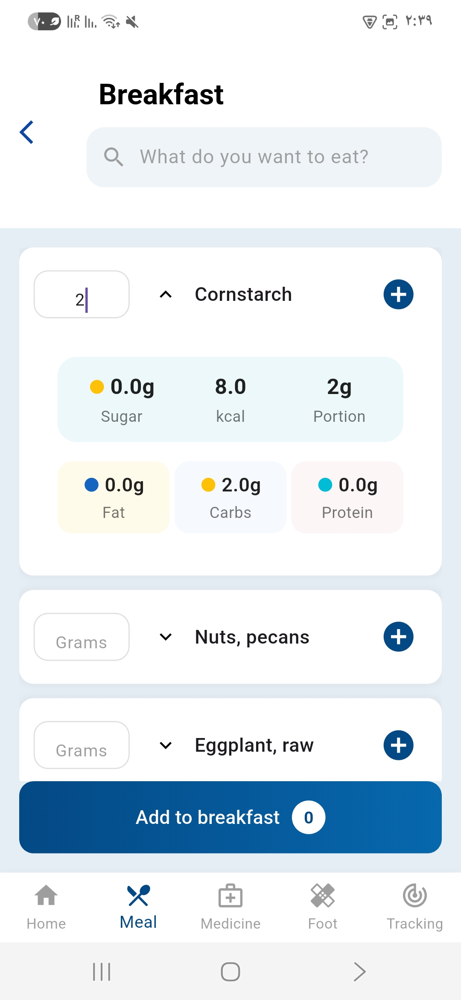|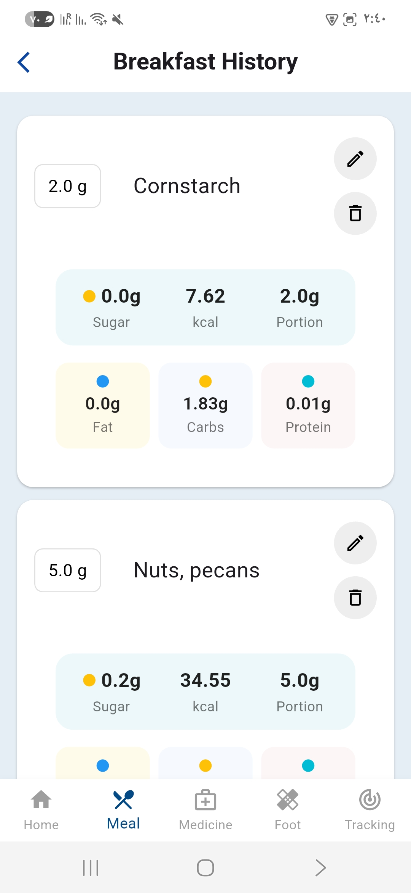|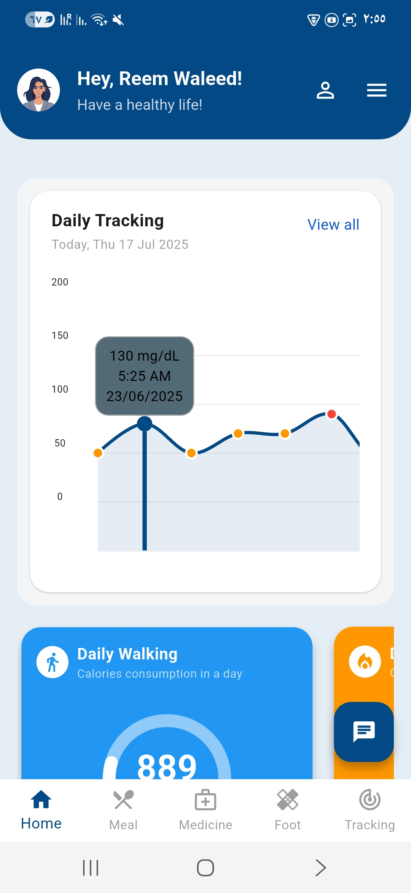|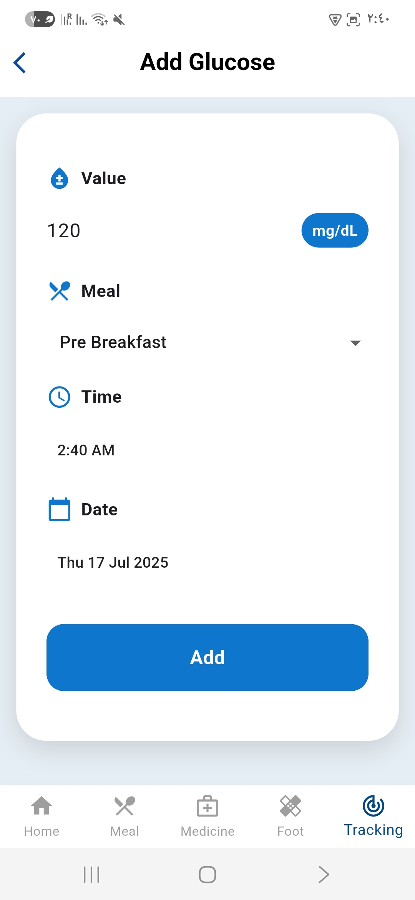|
|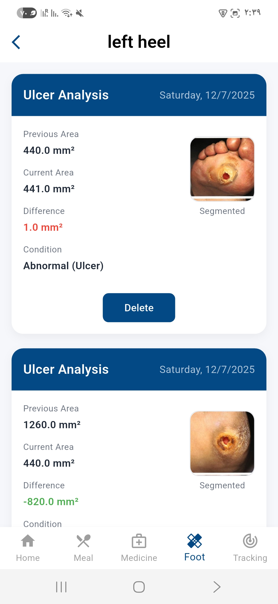|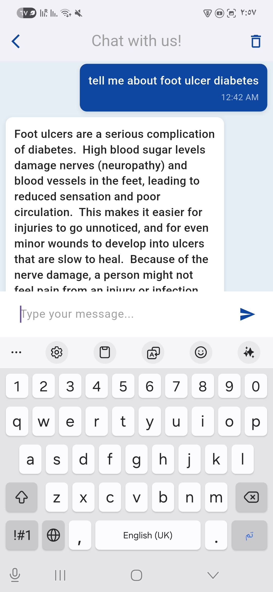|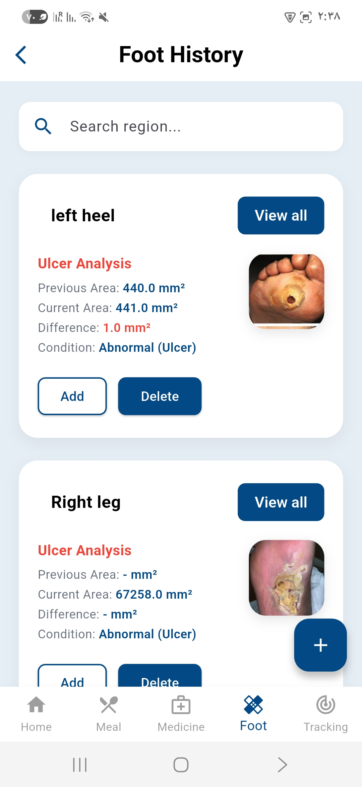|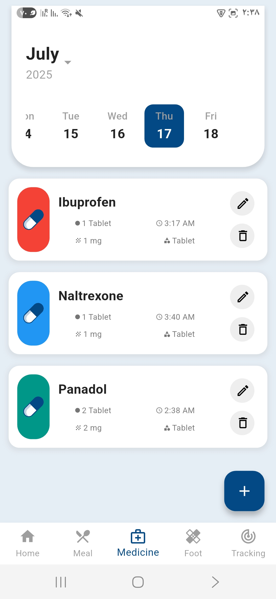|
|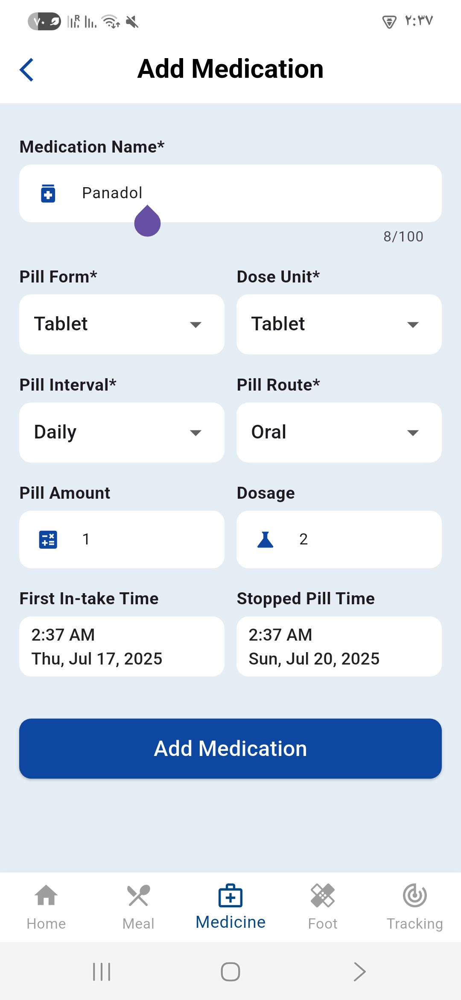|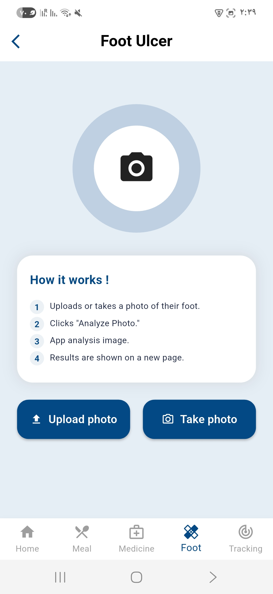|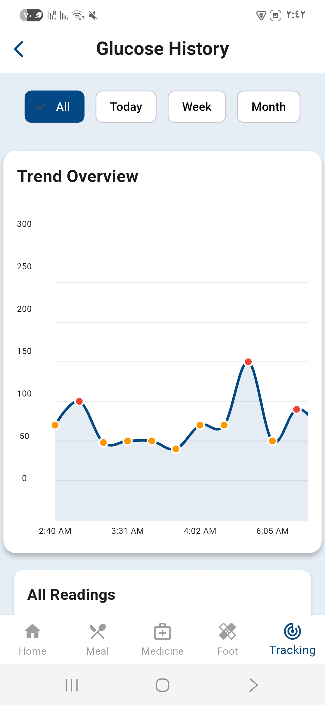|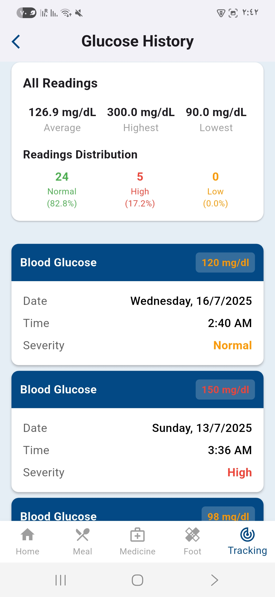|

**Demo Video**: [Watch the Balance Sugar demo video](assets/demo.mp4)

---

## 🚀 Features

- 📈 Glucose tracking with AI-based prediction
- 🥗 Meal logging with full nutrient breakdown
- 💊 Medication reminders with drug interaction checks
- 🦶 Diabetic foot ulcer analysis using deep learning
- 🤖 AI-powered chatbot for instant health assistance
- 📊 Health summaries, trends, and progress charts

---

## 👤 Target Audience

- Type 1 & Type 2 diabetic patients
- Pre-diabetics and at-risk individuals
- Caregivers and family members
- Health professionals (future versions)

---

## 🔧 Tech Stack

| Layer            | Technology                                   |
|------------------|----------------------------------------------|
| Frontend         | Flutter (Dart)                               |
| Backend          | Django, DRF (Django REST Framework)          |
| ML Models        | PyTorch, TensorFlow, Scikit-learn            |
| Chatbot          | LangChain, Google GenAI                      |
| Database         | SQLite                                       |
| Auth             | JWT (SimpleJWT)                              |
| Visualization    | `fl_chart`, `percent_indicator`              |
| Secure Storage   | `flutter_secure_storage`                     |
| Media Upload     | `image_picker`                               |

---

## 📲 Main Modules

- **Authentication**: Secure signup, login, OTP verification, password reset
- **User Profile**: Age, weight, diabetes type, therapy info
- **Home Dashboard**: Glucose graph, calories burned, daily meals
- **Meal Management**: Add, edit, delete meals with calorie insights
- **Glucose Monitoring**: Track readings by time, view history
- **Medication Tracking**: Schedule pills, detect interactions
- **Foot Care**: Upload images, track healing with visual feedback
- **Chatbot Support**: Real-time answers to diabetes questions

---

## 🔒 Security & Privacy

- Encrypted token storage via `flutter_secure_storage`
- Secure backend handling with JWT
- Timezone-aware calculations and summaries

---

## 🧠 AI Capabilities

- Predict glucose spikes or drops after 16 readings
- Analyze drug-to-drug interactions before saving meds
- Segment and measure diabetic foot ulcers from photos
- Intelligent chatbot trained on diabetes FAQs and support topics

---

## 🌍 Localization & Time Handling

- Supports English and Arabic
- Timezone-aware logs, medication schedules, and chat timestamps

---

## 📂 Assets Folder

All visual assets are placed in the `assets/` directory:
```
assets/
├── 1.jpeg
├── 2.jpeg
├── ...
├── 16.jpeg
├── demo.mp4
```
---

## 🙌 Acknowledgments

Special thanks to:

- **Dr. Nabil Mustafa** – Project inspiration and supervision
- **TA. Mohamed Emad** – Technical mentorship and assistant lecturer support

---

## 📄 License

This project is open-source under the **MIT License**.

---

## 🤝 Contributions Welcome

We welcome your feedback, feature suggestions, and pull requests to help improve diabetes management for millions of users worldwide.

